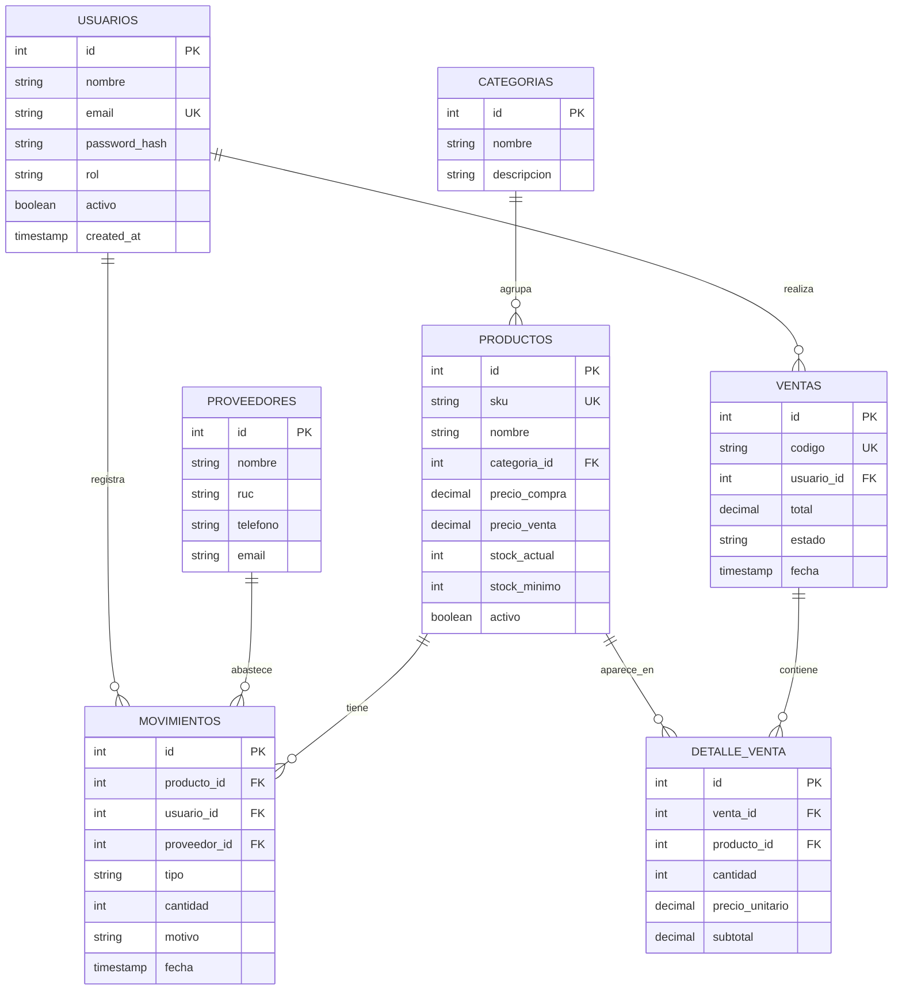

# 🗄️ Modelo de datos

← Volver al [Índice](00-INDICE.md)

Diagrama entidad-relación (ERD) y esquema de la base de datos **PostgreSQL**.
El diagrama usa **Mermaid** (se ve tanto en GitHub como en Obsidian).

## Diagrama ERD



## Notas del modelo

- **`productos.stock_actual`** nunca se edita a mano: siempre cambia a través de un
  registro en **`movimientos`** (entrada / salida / ajuste) o de una venta. Así el
  stock siempre es auditable.
- **`movimientos.tipo`** ∈ `{ 'entrada', 'salida', 'ajuste' }`.
- **`usuarios.rol`** ∈ `{ 'admin', 'vendedor' }`.
- **`ventas.estado`** ∈ `{ 'completada', 'anulada' }`.
- Una **venta** genera automáticamente movimientos de tipo `salida` por cada producto.
- Se usa **borrado lógico** (`activo = false`) en usuarios y productos, no `DELETE`.

## Esqueleto SQL (referencia)

```sql
CREATE TABLE usuarios (
  id            SERIAL PRIMARY KEY,
  nombre        VARCHAR(100) NOT NULL,
  email         VARCHAR(120) UNIQUE NOT NULL,
  password_hash VARCHAR(255) NOT NULL,
  rol           VARCHAR(20)  NOT NULL DEFAULT 'vendedor',
  activo        BOOLEAN      NOT NULL DEFAULT TRUE,
  created_at    TIMESTAMP    NOT NULL DEFAULT NOW()
);

CREATE TABLE categorias (
  id          SERIAL PRIMARY KEY,
  nombre      VARCHAR(80) NOT NULL,
  descripcion TEXT
);

CREATE TABLE proveedores (
  id       SERIAL PRIMARY KEY,
  nombre   VARCHAR(120) NOT NULL,
  ruc      VARCHAR(11),
  telefono VARCHAR(20),
  email    VARCHAR(120)
);

CREATE TABLE productos (
  id            SERIAL PRIMARY KEY,
  sku           VARCHAR(40) UNIQUE NOT NULL,
  nombre        VARCHAR(150) NOT NULL,
  categoria_id  INT REFERENCES categorias(id),
  precio_compra NUMERIC(10,2) NOT NULL DEFAULT 0,
  precio_venta  NUMERIC(10,2) NOT NULL DEFAULT 0,
  stock_actual  INT NOT NULL DEFAULT 0,
  stock_minimo  INT NOT NULL DEFAULT 0,
  activo        BOOLEAN NOT NULL DEFAULT TRUE
);

CREATE TABLE movimientos (
  id           SERIAL PRIMARY KEY,
  producto_id  INT NOT NULL REFERENCES productos(id),
  usuario_id   INT NOT NULL REFERENCES usuarios(id),
  proveedor_id INT REFERENCES proveedores(id),
  tipo         VARCHAR(10) NOT NULL,           -- entrada | salida | ajuste
  cantidad     INT NOT NULL,
  motivo       VARCHAR(200),
  fecha        TIMESTAMP NOT NULL DEFAULT NOW()
);

CREATE TABLE ventas (
  id         SERIAL PRIMARY KEY,
  codigo     VARCHAR(20) UNIQUE NOT NULL,
  usuario_id INT NOT NULL REFERENCES usuarios(id),
  total      NUMERIC(10,2) NOT NULL DEFAULT 0,
  estado     VARCHAR(15) NOT NULL DEFAULT 'completada',
  fecha      TIMESTAMP NOT NULL DEFAULT NOW()
);

CREATE TABLE detalle_venta (
  id             SERIAL PRIMARY KEY,
  venta_id       INT NOT NULL REFERENCES ventas(id),
  producto_id    INT NOT NULL REFERENCES productos(id),
  cantidad       INT NOT NULL,
  precio_unitario NUMERIC(10,2) NOT NULL,
  subtotal       NUMERIC(10,2) NOT NULL
);
```

---
Siguiente: [Arquitectura](05-arquitectura.md) →
