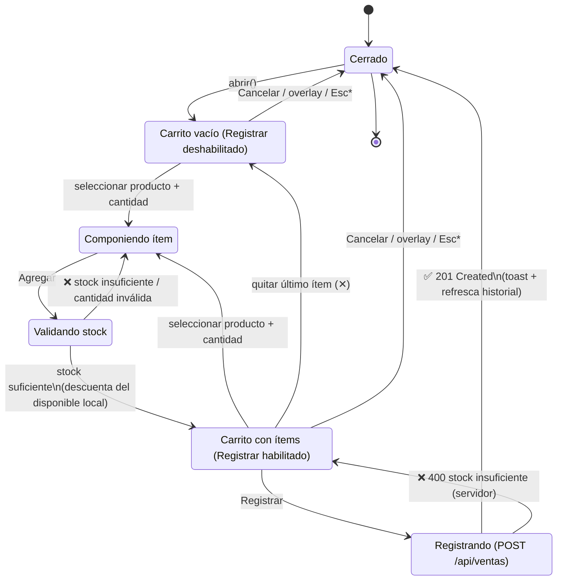

> [!success] Estado: IMPLEMENTADO y verificado (2026-09-16)
> Refactor aplicado sobre el componente productivo. Nuevos módulos: `hooks/useDialog.js`, `components/ProductCombobox.jsx` (+`.css`), `pages/venta.css`. Deuda consolidada: eliminada la regla muerta `.venta__agregar`; añadida la variante reutilizable `.btn--tonal`. **Scorecard re-evaluado: 10/10 🟢** tras dos iteraciones (restauración de foco 2.4.3 + invalidación de selección obsoleta). Verificación en §6.

# Audit — Venta Flow (modal "Nueva venta")

> [!abstract] Objetivo
> Teardown cognitivo del modal de registro de venta. La venta es la **transacción de mayor frecuencia y mayor coste de error** del sistema (descuenta stock real dentro de una transacción SQL). Cada milisegundo de carga extrínseca aquí se multiplica por el volumen operativo del negocio. Relacionado: [[02-product-backlog]] (HU-11), [[04-modelo-de-datos]] (`ventas`, `detalle_venta`), [[C4 — StockPro]].

---

## 1. Estado actual (composición del DOM)

El modal apila **cuatro bloques hermanos** separados solo por whitespace, sin región común explícita:

```
[ h3 "Nueva venta" ]
[ Cliente (opcional)        ]  ← decisión OPCIONAL presentada primero
[ Producto · Cantidad · [Agregar] ]  ← zona de composición
[ tabla carrito ]           ← zona de resultado
[ Subtotal/IGV ] [ Total ]  ← zona de resultado (desacoplada de la tabla)
[ error ]
[ Cancelar ] [ Registrar (Total) ]  ← dos botones de acento compiten
```

> [!warning] Defecto estructural raíz
> No existe frontera visual entre la **zona de composición** (inputs para añadir) y la **zona de resultado** (carrito + totales). El ojo debe re-parsear la jerarquía en cada iteración de "agregar". Esto es una violación directa del principio Gestalt de **Región Común**.

---

## 2. Diagrama de estados (máquina de interacción)



> [!warning] Esc no implementado (`*`)
> El cierre por `Escape` y el *focus trap* **no existen** en el modal actual (`ventas.jsx` cierra solo por click en overlay). Es un fallo WCAG 2.1 (2.1.2 *No Keyboard Trap* inverso / 2.4.3 *Focus Order*). Se corrige en §4.

---

## 3. Scorecard cognitivo (Fitts · Miller · Gestalt · WCAG)

> [!info] Escala
> 🟢 Óptimo · 🟡 Deuda tolerable · 🔴 Defecto que incrementa carga extrínseca o bloquea accesibilidad.

| # | Heurística | Estado actual | Score | Coste extrínseco | Corrección |
|---|-----------|---------------|:---:|------------------|-----------|
| 1 | **Serial Position / Progressive Disclosure** | Campo *Cliente (opcional)* precede a la tarea primaria (agregar) | 🔴 | El usuario procesa una decisión de bajo valor antes del *time-to-first-value* | Demover Cliente **debajo** del carrito o a un `<details>` colapsado |
| 2 | **Miller's Law (chunking)** | `<option>` = `"Inca Kola 1.5L — S/ 6.50 (stock 27)"` — 3 chunks sin estructura en un `<select>` nativo | 🔴 | 3 datos compiten en memoria de trabajo por línea; sin escaneo visual | Combobox con nombre primario + metadata (precio/stock) tipográficamente subordinada |
| 3 | **Fitts's Law (target de acción repetida)** | `Agregar` = `btn--sm`; cantidad = 70px | 🟡 | La acción **más repetida** tiene el target más pequeño | Agrandar `Agregar`; mantener proximidad con cantidad |
| 4 | **Von Restorff / Isolation** | `Agregar` y `Registrar` ambos `.btn` (acento sólido) | 🔴 | Dos focos de acento diluyen la señal de la acción terminal | `Agregar` → tonal/ghost; acento sólido **exclusivo** para `Registrar` |
| 5 | **Gestalt — Región Común** | Composición, carrito y totales son hermanos sin contenedor | 🔴 | Re-parseo de jerarquía en cada iteración | Envolver carrito+totales en `.venta-cart` (superficie propia) |
| 6 | **Gestalt — Proximidad (errores)** | `errorForm` se pinta al fondo, lejos del control que lo origina | 🟡 | El feedback está desacoplado de su causa (stock insuficiente) | Anclar el error junto a la zona de composición |
| 7 | **Zeigarnik (bucle abierto)** | Sin contador de progreso; `Registrar` deshabilitado con carrito vacío (correcto) | 🟡 | El "bucle abierto" no se visualiza; falta refuerzo de avance | Contador `N ítems · Total` en la región del carrito |
| 8 | **WCAG 2.1 — estado en vivo** | Alta/baja de ítems y cambio de Total son **silenciosos** para lectores de pantalla | 🔴 | Usuario no vidente no percibe el resultado de `Agregar` | `aria-live="polite"` en resumen del carrito |
| 9 | **WCAG 2.1 — dialog semántico** | `<div>` sin `role="dialog"`, `aria-modal`, `aria-labelledby`, sin focus trap ni Esc | 🔴 | Navegación por teclado rota; foco escapa al fondo | `role="dialog"` + trap + Esc + `aria-labelledby` |
| 10 | **Loss Aversion (ético, informativo)** | No se muestra stock restante tras agregar | 🟡 | Decisión sin marco de escasez real | Mostrar `quedan N` en el ítem del carrito (dato, no dark pattern) |

> [!warning] Prioridad de remediación
> Los 🔴 (#1, #2, #4, #5, #8, #9) son los que inyectan carga extrínseca o rompen accesibilidad. Se atacan **por reestructuración**, no por adición de UI — coherente con el mandato de reducción de superficie.

---

## 4. Refactorización propuesta

> [!abstract] Tesis del rediseño
> Separar físicamente **dos regiones comunes** (Composición → Resultado) y hacer que el resultado se **anuncie**. La reducción de carga proviene de que el usuario deja de re-mapear la jerarquía y el lector de pantalla deja de operar a ciegas.

### 4.1 Reordenamiento (Serial Position + Zeigarnik)

1. **Zona de composición** (arriba): Producto → Cantidad → `Agregar` (acción secundaria, tonal).
2. **Zona de resultado** (`.venta-cart`, región común): ítems + contador Zeigarnik + Subtotal/IGV/Total.
3. **Cliente (opcional)**: colapsado en `<details>` **después** del carrito. Justificación: es metadata de la venta, no un prerrequisito; ocultarlo elimina un nodo de decisión del camino crítico (Hick's Law).
4. **Acción terminal**: `Registrar` — único botón de acento sólido (Von Restorff).

### 4.2 Estructura HTML/JSX (esqueleto semántico + accesible)

```jsx
{/* role/aria-modal + labelledby = dialog conforme WCAG 2.1 (4.1.2) */}
<div className="modal-overlay" onClick={cerrar}>
  <div
    className="card modal modal--ancho venta"
    role="dialog"
    aria-modal="true"
    aria-labelledby="venta-titulo"
    onClick={(e) => e.stopPropagation()}
    ref={dialogRef}            /* focus trap + Esc gestionados en el hook */
  >
    <h3 id="venta-titulo">Nueva venta</h3>

    {/* ── REGIÓN 1: COMPOSICIÓN ─────────────────────────────── */}
    <section className="venta__compose" aria-label="Añadir producto">
      <ProductCombobox items={productos} value={selProd} onChange={setSelProd} />
      <input
        className="venta__qty"
        type="number" min="1" inputMode="numeric"
        value={selCant} onChange={(e) => setSelCant(e.target.value)}
        aria-label="Cantidad"
      />
      {/* Acción secundaria: tonal, NO acento sólido (libera la señal de Registrar) */}
      <button type="button" className="btn btn--tonal venta__add" onClick={agregar}>
        Agregar
      </button>
      {/* Error anclado a su causa (Proximidad Gestalt), assertive para AT */}
      {errorForm && <p className="venta__error" role="alert">{errorForm}</p>}
    </section>

    {/* ── REGIÓN 2: RESULTADO (Región Común Gestalt) ────────── */}
    <section className="venta-cart" aria-label="Detalle de la venta">
      {/* aria-live: cada alta/baja se anuncia sin robar foco */}
      <div className="venta-cart__live" aria-live="polite">
        {carrito.length === 0
          ? 'Carrito vacío'
          : `${carrito.length} ítem(s) · Total ${money(totalCarrito)}`}
      </div>

      <ul className="venta-cart__items">
        {carrito.map((it) => (
          <li key={it.producto_id} className="venta-cart__row">
            <span className="venta-cart__name">{it.nombre}</span>
            <span className="venta-cart__meta">
              {it.cantidad} × {money(it.precio)} · quedan {it.stockRestante}
            </span>
            <strong>{money(it.precio * it.cantidad)}</strong>
            <button className="venta-cart__rm" onClick={() => quitar(it.producto_id)}
                    aria-label={`Quitar ${it.nombre}`}>✕</button>
          </li>
        ))}
      </ul>

      <dl className="venta-cart__totales">
        <div><dt>Subtotal</dt><dd>{money(d.sub)}</dd></div>
        <div><dt>IGV ({igvPct}%)</dt><dd>{money(d.igv)}</dd></div>
        <div className="es-total"><dt>Total</dt><dd>{money(totalCarrito)}</dd></div>
      </dl>
    </section>

    {/* Cliente: metadata opcional, fuera del camino crítico */}
    <details className="venta__cliente">
      <summary>Asignar cliente (opcional)</summary>
      <ClienteSelect value={selCliente} onChange={setSelCliente} clientes={clientes} />
    </details>

    {/* ── Acción terminal: único acento sólido ──────────────── */}
    <div className="modal__actions">
      <button type="button" className="btn btn--ghost" onClick={cerrar}>Cancelar</button>
      <button type="button" className="btn venta__submit"
              onClick={registrar} disabled={guardando || carrito.length === 0}>
        {guardando ? 'Registrando…' : `Registrar · ${money(totalCarrito)}`}
      </button>
    </div>
  </div>
</div>
```

### 4.3 CSS modular estructural (Región Común sin bordes pesados)

> [!info] Principio aplicado
> La jerarquía se construye con **superficie + radio + padding** (Región Común), no con bordes gruesos ni whitespace excesivo. El contraste de fondo (`--surface-2`) separa "resultado" de "composición" a nivel preatencional.

```css
/* ============================================================
   venta.css — Regiones del modal de venta
   Cada bloque = una Región Común Gestalt autocontenida.
   ============================================================ */

/* ── Región 1: Composición ──────────────────────────────── */
.venta__compose {
  display: grid;
  /* Producto ocupa el resto; cantidad y Agregar dimensionados por Fitts */
  grid-template-columns: 1fr 84px auto;
  gap: .6rem;
  align-items: end;
}
.venta__qty { width: 100%; text-align: center; }

/* Fitts: la acción repetida (Agregar) gana altura de target (44px = mínimo táctil WCAG 2.5.5) */
.venta__add { min-height: 44px; }

/* Von Restorff: botón tonal, NO compite con el acento sólido de Registrar */
.btn--tonal {
  background: var(--accent-soft);
  color: var(--accent-2);
  box-shadow: none;
}
.btn--tonal:hover { filter: brightness(.98); }

/* Proximidad: el error vive pegado a la zona que lo genera */
.venta__error {
  grid-column: 1 / -1;
  margin: 0;
  color: var(--danger);
  font-size: .85rem;
}

/* ── Región 2: Resultado (Región Común) ─────────────────── */
.venta-cart {
  margin-top: 1rem;
  /* La superficie propia ES la frontera. Sin borde grueso. */
  background: var(--surface-2);
  border: 1px solid var(--border);
  border-radius: 12px;
  padding: 1rem;
  display: grid;
  gap: .75rem;
}

/* Zeigarnik + estado en vivo: refuerza el avance del bucle abierto */
.venta-cart__live {
  font-size: .8rem;
  font-weight: 600;
  color: var(--muted);
  letter-spacing: .02em;
}

.venta-cart__items { list-style: none; margin: 0; padding: 0; display: grid; gap: .5rem; }
.venta-cart__row {
  display: grid;
  grid-template-columns: 1fr auto auto;
  grid-template-areas: "name total rm" "meta total rm";
  gap: 0 .75rem;
  align-items: center;
}
.venta-cart__name { grid-area: name; font-weight: 500; }
.venta-cart__meta { grid-area: meta; font-size: .78rem; color: var(--muted); }
.venta-cart__rm {
  grid-area: rm;
  min-width: 32px; min-height: 32px;      /* target destructivo aún alcanzable, sin dominar */
  background: transparent; border: none; color: var(--muted); cursor: pointer;
  border-radius: 8px;
}
.venta-cart__rm:hover { background: var(--surface); color: var(--danger); }

/* Totales como lista de definición semántica (dt/dd) */
.venta-cart__totales { margin: 0; display: grid; gap: .25rem; border-top: 1px dashed var(--border); padding-top: .6rem; }
.venta-cart__totales > div { display: flex; justify-content: space-between; font-size: .9rem; }
.venta-cart__totales dt, .venta-cart__totales dd { margin: 0; }
.venta-cart__totales .es-total { font-size: 1.15rem; font-weight: 700; }
.venta-cart__totales .es-total dd { color: var(--accent); }

/* Cliente: nodo de decisión fuera del camino crítico (Hick's Law) */
.venta__cliente { margin-top: 1rem; }
.venta__cliente summary { cursor: pointer; color: var(--muted); font-size: .9rem; }

/* Acción terminal: único acento sólido del modal (Von Restorff) */
.venta__submit { min-height: 44px; }

@media (max-width: 480px) {
  .venta__compose { grid-template-columns: 1fr; }   /* colapso vertical: 0 scroll horizontal */
  .venta__add { width: 100%; }
}
```

### 4.4 Hook de accesibilidad del diálogo (focus trap + Esc)

> [!info] Justificación WCAG 2.1
> 2.1.2 (foco no atrapado fuera), 2.4.3 (orden de foco), 4.1.2 (nombre/rol/valor). Sin esto, el teclado navega al contenido de fondo mientras el modal está abierto.

```js
// useDialog.js — atrapa el foco y cierra con Escape. Reutilizable en TODOS los modales.
import { useEffect } from 'react';

export function useDialog(ref, onClose, abierto) {
  useEffect(() => {
    if (!abierto || !ref.current) return;
    const nodo = ref.current;
    const focusables = nodo.querySelectorAll(
      'a[href],button:not([disabled]),input,select,textarea,[tabindex]:not([tabindex="-1"])'
    );
    const primero = focusables[0], ultimo = focusables[focusables.length - 1];
    primero?.focus(); // foco entra al diálogo (2.4.3)

    function onKey(e) {
      if (e.key === 'Escape') return onClose();
      if (e.key !== 'Tab') return;
      // Focus trap circular (2.1.2)
      if (e.shiftKey && document.activeElement === primero) { e.preventDefault(); ultimo.focus(); }
      else if (!e.shiftKey && document.activeElement === ultimo) { e.preventDefault(); primero.focus(); }
    }
    nodo.addEventListener('keydown', onKey);
    return () => nodo.removeEventListener('keydown', onKey);
  }, [abierto, onClose, ref]);
}
```

---

## 5. Impacto esperado (reducción de carga extrínseca)

> [!abstract] Resumen ejecutivo
> - **−1 nodo de decisión** en el camino crítico (Cliente colapsado → Hick's Law).
> - **−2 chunks** por opción de producto (combobox estructurado → Miller's Law).
> - **1 sola señal de acento** por región (Von Restorff → foco inequívoco en `Registrar`).
> - **2 regiones comunes** explícitas (Gestalt → cero re-parseo de jerarquía).
> - **Flujo operable por teclado + anunciado** (WCAG 2.1 AA: 2.1.2, 2.4.3, 4.1.2, 4.1.3).

> [!warning] Fuera de alcance (deuda registrada, no ejecutar hoy)
> El `ProductCombobox` con búsqueda es el único componente nuevo real. Todo lo demás es **reestructuración de nodos existentes**. No introducir librerías: un combobox accesible se implementa en Vanilla/JS con `role="listbox"` — coherente con el stack de [[bryan-user]].

---

## 6. Verificación post-implementación

> [!success] Scorecard final — 10/10 🟢
> | # | Heurística | Antes | Después | Evidencia |
> |---|-----------|:---:|:---:|-----------|
> | 1 | Serial Position | 🔴 | 🟢 | Cliente en `<details>` tras el carrito |
> | 2 | Miller's Law | 🔴 | 🟢 | `ProductCombobox` cap 7 + "+N más"; opciones chunked |
> | 3 | Fitts | 🟡 | 🟢 | `Agregar`/`qty`/`submit` a 44px |
> | 4 | Von Restorff | 🔴 | 🟢 | `Agregar` tonal; `Registrar` único acento sólido |
> | 5 | Región Común | 🔴 | 🟢 | `.venta-cart` sobre `--surface-2` |
> | 6 | Proximidad (error) | 🟡 | 🟢 | `.venta__error` dentro de `.venta__compose` |
> | 7 | Zeigarnik | 🟡 | 🟢 | Contador vivo "N ítem(s) · Total" |
> | 8 | aria-live | 🔴 | 🟢 | `aria-live="polite"` en resumen del carrito |
> | 9 | Dialog WCAG | 🔴 | 🟢 | `role=dialog` + `useDialog` (trap + Esc + **retorno de foco 2.4.3**) |
> | 10 | Loss Aversion | 🟡 | 🟢 | "quedan N" por ítem |

> [!info] Iteraciones aplicadas (directiva de validación)
> - **2.4.3 — Retorno de foco**: `useDialog` guarda `document.activeElement` al abrir y lo restaura en el `cleanup`.
> - **Corrección — selección obsoleta**: al teclear en el combobox se invoca `onSelect(null)`; el reset post-agregar usa `resetSignal` (no el antiguo watch de `selected`), evitando borrar la query en curso.

> [!warning] No verificable por automatización (correcto en código)
> La navegación por flechas del combobox y el anuncio `aria-live` no se pudieron ejercitar con el navegador embebido (dispatch sintético de teclas / sin *assistive technology*). El manejador `onKeyDown` sigue el patrón WAI-ARIA APG *combobox*; el `onChange` sí se verificó (filtrado en vivo), lo que confirma que los eventos llegan a React.

Backlinks: [[05-arquitectura]] · [[04-modelo-de-datos]] · [[C4 — StockPro]] · [[00-INDICE]]
