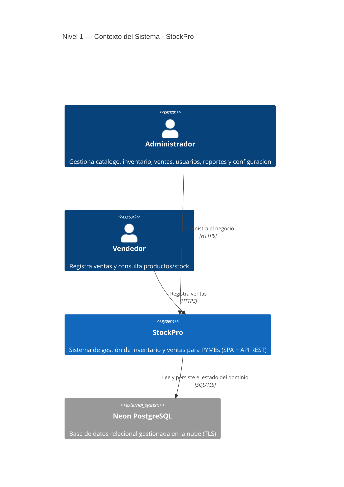
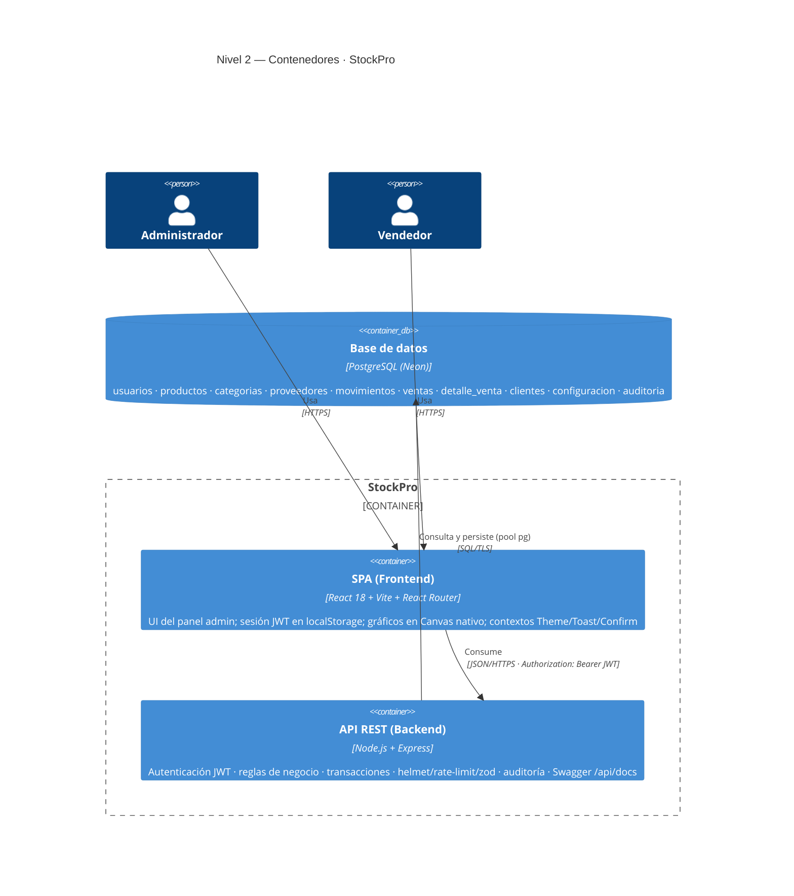
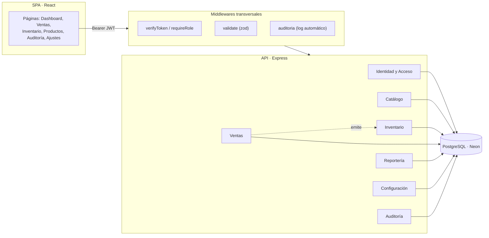

# C4 — StockPro (Context & Container)

> [!abstract] Propósito
> Modelar los límites del sistema con el **C4 Model** (niveles 1–2) de forma que el diagrama sea un espejo fiel del **lenguaje ubicuo (DDD)** presente en el código y la base de datos. Ver [[04-modelo-de-datos]] (tablas) y [[05-arquitectura]] (endpoints). Auditoría de UI asociada: [[Audit — Venta Flow]].

> [!warning] Requisito de render
> Los bloques `mermaid` usan la sintaxis nativa **C4** de Mermaid (`C4Context` / `C4Container`), disponible desde Mermaid ≥ 9.3 (Obsidian ≥ 1.1). Si tu vault usa una versión anterior, activa *Settings → Appearance → Mermaid* actualizado o renderiza vía CLI.

---

## 1. Lenguaje ubicuo → Bounded Contexts

> [!info] Regla de correspondencia
> Cada *bounded context* mapea 1:1 a un grupo de rutas Express y a un conjunto de tablas. El nombre del contexto **es** el término del dominio usado en el código. Sin traducción, sin sinónimos: eso es lo que elimina fricción entre negocio y persistencia.

| Bounded Context | Lenguaje ubicuo (términos) | Rutas (`/api/*`) | Tablas |
|-----------------|----------------------------|------------------|--------|
| **Identidad y Acceso** | usuario, rol (admin/vendedor), sesión, JWT | `auth`, `usuarios` | `usuarios` |
| **Catálogo** | producto, SKU, categoría, proveedor, precio | `productos`, `categorias`, `proveedores` | `productos`, `categorias`, `proveedores` |
| **Inventario** | movimiento (entrada/salida/ajuste), stock, stock mínimo, alerta | `movimientos` | `movimientos`, `productos.stock_actual` |
| **Ventas** | venta, detalle de venta, cliente, IGV, comprobante | `ventas`, `clientes` | `ventas`, `detalle_venta`, `clientes` |
| **Reportería** | dashboard, más vendidos, valor de inventario | `dashboard`, `reportes` | *(vistas de lectura sobre las anteriores)* |
| **Auditoría** | registro, acción, entidad | `auditoria` | `auditoria` |
| **Configuración** | negocio, moneda, IGV %, logo | `configuracion` | `configuracion` |

> [!warning] Invariante de dominio (crítico)
> El término **stock** no es un campo editable: es un *derived state* que solo muta por un `movimiento` o una `venta`, **siempre dentro de una transacción** (`FOR UPDATE`). El diagrama de Contenedor debe dejar explícito que la API —no el cliente— es la guardiana de esta invariante. Ver [[Audit — Venta Flow]] §2.

---

## 2. Nivel 1 — Diagrama de Contexto

> [!abstract] Alcance
> Quién usa StockPro y de qué depende. Se ocultan los contenedores internos (nivel 2). Dos actores por rol; la persistencia gestionada (Neon) se muestra como sistema externo por ser infraestructura de terceros.

---

## 3. Nivel 2 — Diagrama de Contenedores

> [!abstract] Alcance
> Las piezas desplegables y sus protocolos. La frontera `StockPro` contiene SPA + API; la base de datos vive fuera (Neon). Los **módulos DDD** se listan dentro de cada contenedor para que la topología técnica y el dominio coincidan.

---

## 4. Módulos de la API (mapa DDD ↔ código)

> [!info] Correspondencia física
> Cada contexto se materializa como `routes/<x>.routes.js` → `controllers/<x>.controller.js`. La transversalidad (auth, validación, auditoría) vive en `middlewares/`. Esto mantiene el *ubiquitous language* desde la URL hasta la tabla.

> [!warning] Acoplamiento intencional (Ventas → Inventario)
> La relación punteada `Ventas ⇢ Inventario` no es un atajo: al registrar una `venta`, la API genera **movimientos de salida** por cada `detalle_venta` en la misma transacción. Es la materialización del invariante de stock. Cualquier refactor que rompa esta atomicidad corrompe el dominio.

---

## 5. Decisiones de arquitectura (ADR-lite)

> [!info] Por qué esta topología y no otra
> - **SPA + API separadas** (no SSR monolítico): despliegue independiente (Vercel + Render), y la API se vuelve reutilizable para una futura app móvil sin reescribir dominio.
> - **JWT stateless**: sin tabla de sesiones; escala horizontalmente sin *sticky sessions*. Coste: revocación no inmediata (aceptable para el volumen PYME).
> - **Persistencia gestionada (Neon)**: elimina operación de BD; la misma URL sirve dev y prod (ver [[05-arquitectura]]).
> - **Reglas de negocio en la API, nunca en el cliente**: el SPA es descartable/observable; la invariante de stock y los permisos por rol se validan server-side (defensa en profundidad).

Backlinks: [[05-arquitectura]] · [[04-modelo-de-datos]] · [[Audit — Venta Flow]] · [[00-INDICE]]
